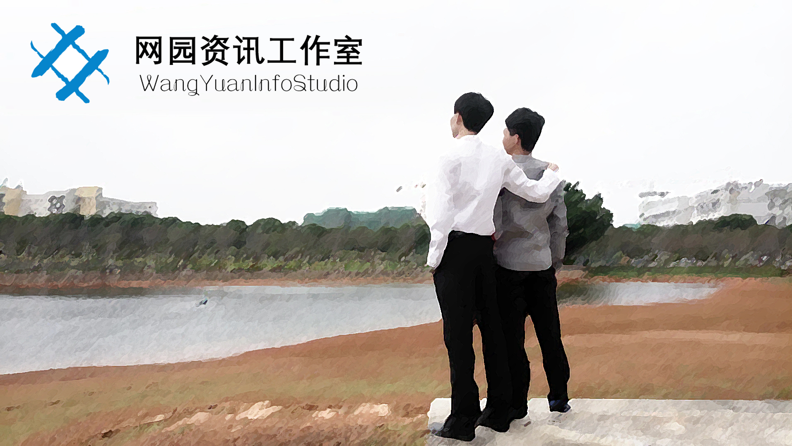

# 网园编程部第三轮考核

-----

## 考核主题

&nbsp;&nbsp;&nbsp;&nbsp;&nbsp;&nbsp;&nbsp;&nbsp;&nbsp;制作一个CMS新闻发布和管理平台（前台客户端&后台管理系统）。

## 考核内容

**1.  考核作业部分：** 

&nbsp;&nbsp;&nbsp;&nbsp;&nbsp;&nbsp;&nbsp;&nbsp;&nbsp;给定前端模板，自主设计一份业务逻辑图，并制作一个基于*C#*和*SQL Server*的*ASP.NET*动态网站，要求实现给定的基本功能，完成基本功能后如有时间和精力，可继续完成扩展功能。允许适当修改前端代码，允许自行添加页面，但总体风格不能改变。

**2. 个人素质部分：** 

- 注重提高自主学习能力，善于发现问题和解决问题；
- 养成严谨的治学态度，考虑事物周到全面；
- 养成爱钻研、精益求精的精神；
- 养成低调而不沉闷、幽默而不浮夸、自信而不傲慢的性格。

## 考核时间

- 考核开始时间：想什么时候开始就什么时候开始；
- 初版提交时间：开学前一星期内（2月25日—3月4日）；
- 最终截止时间：开学第三天晚上12点（3月8日0点）；
- 三轮面试时间：开学后的第一个周末。

## 作业提交

- 在初版提交时间内，将所有网页文件（.aspx文件、aspx.cs文件、C#类文件、Web.config配置文件等）、相关资源（CSS、js、业务逻辑图、其他图片、富文本编辑器插件等）以及分离的数据库文件（.mdf文件和_log.ldf文件）一起压缩打包上传到编程部作业系统。

- 提交初版后仍可继续完善作业，并在最终截止时间之前提交修改版（同样方式压缩打包），无论有没有写完，都记得按时提交，逾期不候！

- 作业系统限制文件大小为20M以内，若大于20M，请联系师兄！

- 提交途径：

  > 网址：[http://hws.yuanmoc.com](http://hws.yuanmoc.com)或[http://hws.yowfung.cn](http://hws.yowfung.cn)
  >
  > 账号：姓名或学号&nbsp;&nbsp;&nbsp;&nbsp;&nbsp;&nbsp;&nbsp;&nbsp;&nbsp;密码：QQ号码

## 基本功能（必选）

**1.业务逻辑图：**

&nbsp;&nbsp;&nbsp;&nbsp;&nbsp;&nbsp;&nbsp;&nbsp;&nbsp;打开给定的前端模板页面，结合以下的页面功能及技术要求，首先要了解该网站系统的基本业务需求，然后再根据自己的具体构思，用Word或Visio等软件画一个简单的业务逻辑图，画好后生成一张jpg或png图片文件。若不会使用软件画图，也可以自己手动画一张图（线条工整、字迹清晰）然后拍照下来。

**2. 页面功能部分：**

- 前台客户端：
  - `首页(index.html)`：绑定新闻分类，及各分类的最新新闻列表；
  - `分类列表页(list.html)`：分页显示某个分类的所有新闻，或显示搜索到的相关新闻；
  - `详细内容页(article.html)`：显示新闻的具体内容及发布人、阅读数和评论等；
  - `发布和编辑页(share.html)`：发布新的新闻，或修改已发布的新闻；
  - `感想页(idea.html)`：写下你这一学期在网园的学习体会、想对网园说的话、假期编程和自学的感受、对这个新闻发布系统的构思以及本次考核中使用的新技术或遇到的难题等，字数不限，自由发挥。
  - `用户主页(user.html)`：登录、注册、显示资料、修改资料、修改密码、查看该用户发布的新闻等；
- 后台管理系统：
  - `登录页(admin/login.html)`：管理员的登录。
  - `管理页(admin/index.html)`：用户管理栏、新闻管理栏、分类管理栏、发布新闻栏、创建分类等，含有删除和修改等功能。

  > *对于以上的页面功能，不理解的应及时联系师兄！*

**3. 编程技术部分：**

- 已学过的技术：
  - `使用数据库的增删查改`；
  - `实现搜索功能`（数据库的模糊查询）；
  - `使用Session会话管理`（也可以使用Cookie或Token技术）；
  - `使用GET传值进行分页`（其他地方有使用GET传值必要的也可以自行使用）。

  > *对于以上的已学知识，如有不懂，应及时查看PPT和Q群里的教程文件。*

- 需自学的技术：
  - `自主写一个C#类文件`（将常用功能封装成类即可，参考：[推荐教程1](https://ke.qq.com/course/60266)、[推荐教程2](https://www.imooc.com/learn/554)）；
  - `使用Repeater的嵌套`（即一个*Repeater*里面还有另一个*Repeater*）；
  - `实现控件的遍历`（即寻找指定参数的控件，可在Repeater的ItemDataBound事件中使用）；
  - `使用MD5算法对密码进行加密`（数据中不应出现明文密码）。

  > *对于以上的需自学的知识，如有不懂，可查阅资料或在微信群互相讨论。*

## 扩展功能（可选）

- 实现新闻的高级管理（预览、审核、排序、推荐、置顶、回收等）；

- 对前台首页的轮播图进行动态添加、删除和修改；

- 实现富文本编辑新闻（参考KindEditor、UEditor等）；

- 实现验证码的随机产生、图片生成、加密存储和自动销毁等；

- 实现数据库的联表查询；

- 实现简单的数据库防注入攻击；

- 实现文件/图片上传功能；

- 实现局部异步刷新(参考UpdatePanel控件等)。

  > *大家根据自己的能力和时间做，此部分不作要求，有兴趣可从这方面提高自己的能力。*

## 评分参考

**1.  考核作业部分：** 

- 业务逻辑图的可行性；
- 文件命名及存放的合理性；
- 页面布局（风格有无大变、布局有无错乱等）；
- 代码的规范、封装和优化；
- 数据库设计的合理性；
- 网站的运行效果，实际效果跟业务逻辑图是否匹配，是否有报错或明显漏洞等；
- 基本功能完成的程度；
- 扩展功能可适当加分；

**2. 个人素质部分：**

&nbsp;&nbsp;&nbsp;&nbsp;&nbsp;&nbsp;&nbsp;&nbsp;&nbsp;主要看个人性格、对待后端编程的态度、培训时的出勤率、平时作业以及前两次考核的完成情况、小比赛时的表现（只考虑后端）、值班时的表现、假期自学情况、三轮面试以及其他途径的观察。

## 参考网站

[W3school](http://www.w3school.com.cn/)&nbsp;&nbsp;&nbsp;&nbsp;&nbsp;&nbsp;&nbsp;&nbsp;&nbsp;[W3Cschool](https://www.w3cschool.cn/)&nbsp;&nbsp;&nbsp;&nbsp;&nbsp;&nbsp;&nbsp;&nbsp;&nbsp;[GitHub](https://github.com/)&nbsp;&nbsp;&nbsp;&nbsp;&nbsp;&nbsp;&nbsp;&nbsp;&nbsp;[RUNOOB](http://www.runoob.com/)&nbsp;&nbsp;&nbsp;&nbsp;&nbsp;&nbsp;&nbsp;&nbsp;&nbsp;[iMooc](https://www.imooc.com/)&nbsp;&nbsp;&nbsp;&nbsp;&nbsp;&nbsp;&nbsp;&nbsp;&nbsp;[CSDN](https://www.csdn.net/)

[微软ASP.NET官方文档](https://docs.microsoft.com/zh-cn/aspnet/#pivot=aspnet)&nbsp;&nbsp;&nbsp;&nbsp;&nbsp;&nbsp;&nbsp;&nbsp;&nbsp;[微软C#官方文档](https://docs.microsoft.com/zh-cn/dotnet/csharp/)&nbsp;&nbsp;&nbsp;&nbsp;&nbsp;&nbsp;&nbsp;&nbsp;&nbsp;[微软SQL Server官方文档](https://docs.microsoft.com/zh-cn/sql/)

## 重要说明

- 本次考核作业，要求在寒假期间完成，其中部分功能需要自学。

- 记得按时提交作业噢，逾期就全白费了。

- 给出的前端页面只有基本功能，部分页面可能不够全面，你们可根据自己的实际情况自行修改前端代码或添加新的页面。

- 本次考核将作为网园编程部的最终录取参考，请大家严肃对待。

- 本次考核对16级的要求会相对高一些，在实力相差不大的情况下，我们会优先录取17级的，望知悉。

- 希望大家能独立完成，当然可以充分利用身边的可用资源（例如百度、书籍、微信群讨论、请教某位高手等）。可以参考他人的代码，但是严禁抄袭，一经发现将取消录取资格。

- 在能保证完成作业的前提下，如对PHP、Linux、网站搭建等感兴趣的，可以私聊师兄。

- 有问题不怕，主要是要学会自己解决问题，编程部的每一位师兄都是这样过来的，希望大家坚持下去，不仅是为了考核，更是为了编程这一伟大事业。大家如果在学习中遇到什么困难或问题，可以通过QQ、微信、电话等联系网园的师兄师姐们（前提是自己有思考过和百度过），不要把问题藏在心底，憋久了会坏的。记得随时保持联系。

  > *师兄们的联系方式：*  
  >
  > *群&nbsp;&nbsp;&nbsp;&nbsp;主：672650*  
  > *三师弟：664464*  
  > *悠&nbsp;&nbsp;&nbsp;&nbsp;风：662961*

- 另外，注意劳逸结合，代码写累了就多出去浪浪，或者找师兄们聊聊天，谈谈人生和理想。注意合理安排时间，不要经常熬太晚。扩展功能实在不会的就不要勉强，反正是选做的，可以不做，把会做的都做好来，把基础学扎实来才是最实际的。

- 师兄们也学疏才浅，如果你们有什么好的idea，或者有什么伟大的发现，记得跟我们分享哦！

- 最后，预祝大家新年快乐、寒假玩得愉快、学习也愉快！

----

