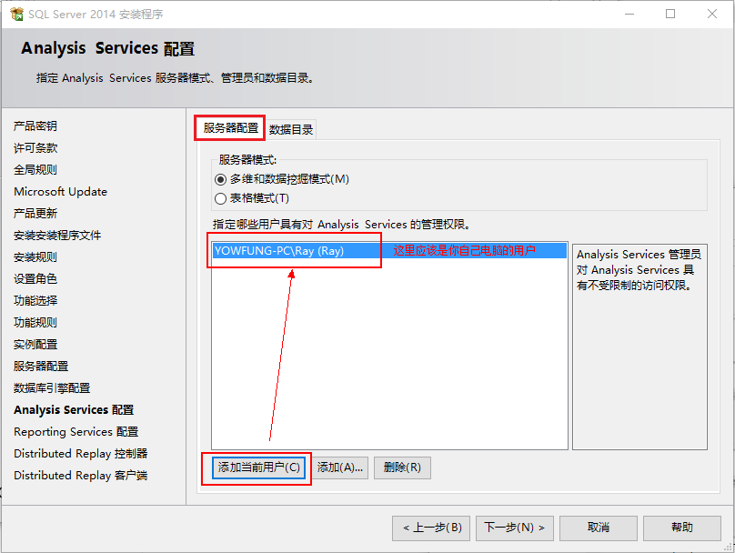

# SQL Server 2014的下载和安装教程

网园资讯工作室  编程部  2017/10/24

------

### SQL Server 2014的下载

- 下载之前一定要先弄清楚自己电脑的系统是32位的还是64位的，32位的系统是无法安装64位软件的。在桌面右击“此电脑”，选择“属性”。在弹出的系统信息界面中可以看到自己的系统是多少位。

  

    

​     

- 以下提供多种SQLServer 2014的下载途径，请选择跟自己电脑系统对应位数（32位或64位）的版本，不要下错。

  **下载方式1：**在Q群文件里下载

  **下载方式2：**拿U盘到网园（黎灿308）来拷贝

  **下载方式3：**迅雷下载（[点击下载32位版](ed2k://|file|cn_sql_server_2014_enterprise_edition_x86_dvd_3932303.iso|2420928512|8943AF1FDFD5B9C0566A0BF818F666DA|/) | [点击下载64位版](ed2k://|file|cn_sql_server_2014_enterprise_edition_x64_dvd_3932882.iso|2898847744|A33CE10CD989083D1AD882DF0D56CFBE|/)）

  **下载方式4：**[百度网盘下载](https://pan.baidu.com/s/1cAlvxO)

  *注：若想要其他版本的SQL Server，可以到 [MSDN,我告诉你](https://msdn.itellyou.cn/)这里去下载。电脑配置好点的可以下载2016版或2017版。不同版本的SQL Server安装步骤可能不同，但总体是差不多的，故在此不作详细介绍，此教程仅针对2014版的。另外，由于我们课程用的是2014版，所以如果你对这个软件不熟悉的话，不建议使用其他版本的。*

  ​    

### SQL Server 2014的安装

1. 打开下载目录，找到刚刚下载的SQL Server 2014安装镜像（.iso文件），点击右键，然后加载至虚拟光驱。（如果是U盘拷贝的，请先复制到电脑上再加载至虚拟光驱。）

   *ps：如果右键没有`加载虚拟光驱`或`装载`这些选项，可以下载安装”好压“这个软件，好压自带有加载至虚拟光驱的功能。或者直接用压缩工具解压出来再安装也可以（可能解压时间会比较久）。*

   

   ​     

2. 加载成功后，打开“此电脑”，可以看到出现了SQL Server 2014的安装光盘，打开光盘，找到`setup.exe`并双击打开。

   

      

​     

3. 运行安装程序后，出现以下界面，在左边点击`安装`，然后右边点击`全新SQL Server独立安装或向现有安装添加功能`。

   

   ​    

4. 接着出现"产品密钥"界面，这里已经默认填好了密钥，不需更改，直接点`下一步`。

   

   ​    

5. 接下来是"许可条款"界面，勾选`我接受许可条款`，然后`下一步`。

   

   ​    

6. 正在进行规则检查，如果此过程出现报错，则必须更正所有失败，安装程序才能继续。

   

   ​    

7. 全局规则检查没有问题后，出现以下的"Microsoft Update"界面，此处不勾选检查更新，直接`下一步`。

   

   ​    

8. 接着是"产品更新"界面，这里我们不进行产品更新，点击`跳过扫描`，出现下面的“安装安装程序文件”界面时点击`下一步`。

   

      

​      

9. 在下面的“安装规则”界面中，必须更正所有失败，安装程序才能继续。

   

   ​     

10. 在“设置角色”界面，选择`SQL Server功能安装`，然后`下一步`。

   

   ​     

11. 在“功能选择”这里点击`全选`，然后根据自己的实际情况选择`实例根目录`（注意，必须是英文路径），然后`下一步`。

    

    ​        

12. "实例配置"界面这里选择`默认实例`，然后`下一步`。

    

    ​    

13. "服务器配置"这里不需要我们更改，保持默认并`下一步`。

    

    ​     

14. “数据库引擎配置”这里是重点啦！顶部有三个选项，点选择`服务器配置`，然后中间那里选择`混合模式`，并设置一个SQLServer系统管理员密码。接着下面指定SQL Server管理员，点击`添加当前用户`，此时列表中会出现当前的用户，先不要点下一步。

    

    ​     

15. 继续刚才那个界面，现在点击顶部的`数据目录`，在这里你可以自己设置数据根目录等，建议保持默认不作修改，“FILESREAM”这里不需要更改，直接点`下一步`。

    

    ​    

16. 接下来是“Analysis Services”界面，这里有三个选项，顶部这里先选择`服务器配置`，服务器模式选择`多维和数据挖掘模式`，在下面的管理权限中点击`添加当前用户`，此时列表中会出现你电脑的当前用户，设置好之后不要点下一步。

    

    ​    

17. 还是刚刚那个界面，现在顶部选择`数据目录`，在这里你可以修改数据目录、日志文件目录、Temp目录、备份目录，建议保持默认不修改，然后`下一步`。

    

    ​     

18. “Reporting Services配置”界面中我们按下图所示进行选择，然后`下一步`。

    

    ​     

19. 接下来的“Distributed Replay控制器”界面中同样也是点击`添加当前用户`，此时列表中会出现你电脑的当前用户，然后`下一步`。

    

    ​    

20. “Distributed Replay客户端”界面不需要做任何修改，`下一步`。

    

    ​    

21. 到了现在，安装前所有的准备工作都已经做好了，现在可以点击`安装`按钮开始安装了。

    

    ​    

22. 正在安装中，这是一个漫长的过程......

    

    ​     

23. 安装成功，此时可以在列表中看到`成功`状态，点击`关闭`。

    

    ​    

24. 现在，最开始的这个窗口也可以关闭掉了。至此SQL Server 2014的安装就完成了。

    

    ​     

25. 安装完成后，默认在桌面是没有图标的。可以按下键盘的`Win+S`，输入`SQL...`，此时会出现一个`SQL Server2014 Management Studio`，点击它就可以打开SQL数据库管理界面了。或者也可以点击开始菜单，在`所有程序`里也可以找到。

    

    ​     

26. 打开SQL Server 2014 Management Studio之后就是这样的界面。

    

    ​      

### SQL Server 相关教程

- [SQL Server数据库连接](http://tutorial.yowfung.cn/04/)
- [SQL Server数据库和表的创建、分离和附加](http://tutorial.yowfung.cn/05/)
- [ASP.NET（C#）连接SQL Server数据库](http://tutorial.yowfung.cn/06/)
- [SQL Server常用查询语句](http://tutorial.yowfung.cn/07/)

